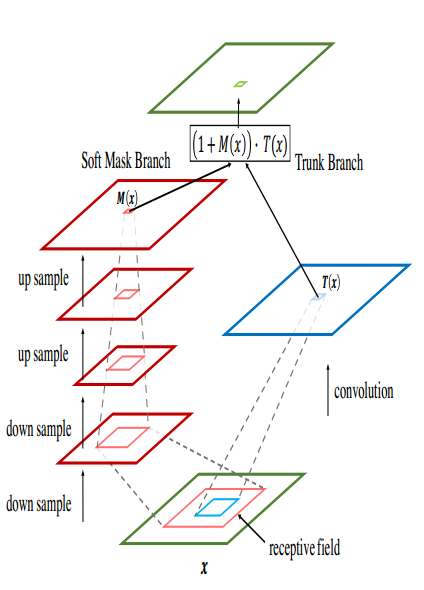

## Residual Attention Network for Image Classification

- **Authors**: Fei Wang, Mengqing Jiang
- **Link**: https://arxiv.org/abs/1704.06904
- **Tags**: `SenseTime` `Attention` 
- **Year**: 2017 
- **Official Code**: https://github.com/fwang91/residual-attention-network

### Motivation

- Attention机制不仅仅可以帮助channel的加强, 还可以增强物体在不同位置的表达   
  
### HOW
####  **Bottom-up top-down feedforward attention**
- 使用类似于Stacked Hourglass 沙漏型的结构 在feature map上增加一个soft weight  
- **Bottem-up** 结构产生了低分辨率但是强语义信息的Feature Map  
- **Top-Down** 结构则 负责产生 高分辨率的Dense的结果   
- **Skip-Connect** 结构来帮助信息的融合    
  
- 由两个分支组成
    - **Trunk主干分支**: 预激活的残差块(Resnet V2)  -- **T(x)**
    - **Mask分支**: bottom-up top-down 结构 --和 T(x) 相同Size的 **M(x)**
    - 最终 $$H(x) = M(x)*T(x)$$ 直接点乘    
  
- Attention Residual Learning
    - 如果只是简单的堆叠Attention模块,回导致性能的下降
        - 因为 mask的值(经过sigmoid)是 0-1, 反复的乘以 这个mask 会导致 feature map的值越来越小  
        - soft mask 可能会 破坏 主干分支的特性  
    - 所以最终 $H(x) = (1+M(x)) * F(x) $ 其中 $0<M(x)<1 $
  
- 希望 mask能够抑制主干分支的噪声, 增强重要的特征  

- **Soft Mask Branch**
    - 使用 max-pool来降低增大感受野,双线性插值来增大分辨率 bottom-up和top-down对称   
    - Mask分支的主要目的还是增强 Trunk分支  
    

- **Spatial** Attention and **Channel** Attention
    - 只需要通过一个 sigmoid 就能实现最佳的效果  
    - 不需要 SENet那样的 仅对通道 weight或是仅对空间 weight
    - 
###  KeyWord
> The
Attention Module is designed to **suppress noise** while **keeping useful information** by applying **dot product between feature and soft mask**.  
> However, **repeated dot product** will lead
to **severe degradation** of both useful and useless information
in this process. 
> The attention residual learning can relieve
signal **attenuation using identical mapping**, which enhances
the feature contrast. 

