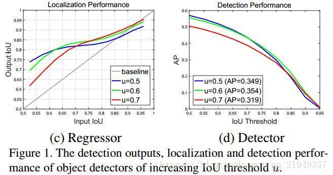

## Cascade R-CNN: Delving into High Quality Object Detection
- **Authors**: Zhaowei Cai, Nuno Vasconcelos
- **Link**: https://arxiv.org/abs/1712.00726
- **Tags**: `R-CNN` `Object Detection`
- **Year**: 2017 
- **Official Code**: https://github.com/zhaoweicai/cascade-rcnn

### Motivation
- 在目标检测时, 需要分类和回归, 分类的时候选择IoU阈值来确定正负样本, 只有正样本会参与到回归中  
    - 但是 随着 **IoU阈值的提高**  
        - 正样本 成指数级的减少 
        - inference阶段,  
    - 固定阈值 会出现很多 close false postives   

###  KeyWord
a single detector can only be optimal for a single quality level.    

### Detail

- 图1: 

#### WHY

