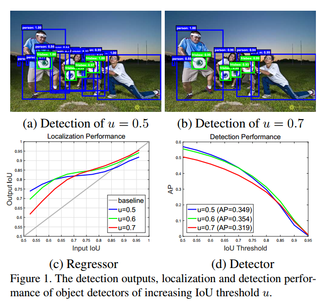
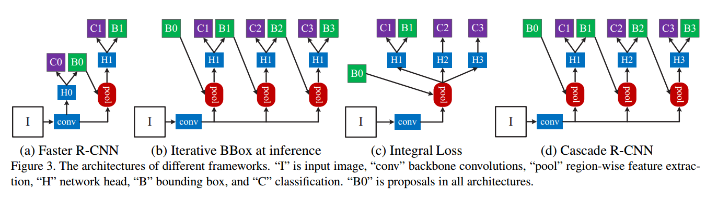

## Cascade R-CNN: Delving into High Quality Object Detection
- **Authors**: Zhaowei Cai, Nuno Vasconcelos
- **Link**: https://arxiv.org/abs/1712.00726
- **Tags**: `R-CNN` `Object Detection`
- **Year**: 2017 
- **Official Code**: https://github.com/zhaoweicai/cascade-rcnn

### Motivation

- 在目标检测时, 需要分类和回归, 通过IoU来判断样本是否是正样本, **IoU的选取对train 和 inference的影响都很大**:
    - 图a,b 表示的是如果IoU的阈值选择的过低, 就会出现 过多的 “close” false positives, 这部分样本和
    - 图c中横轴表示**proposal和GT的IoU**，纵轴的是经过**box reg后和GT的IoU**, 不同曲线表示不同IoU阈值训练出的detector  
        - 在0.55-0.6的范围内阈值为0.5的detector性能最好，在0.6-0.75阈值为0.6的detector性能最佳，而到了0.75之后就是阈值为0.7的detector了  
        - **只有proposal自身的阈值和训练器训练用的阈值较为接近的时候，训练器的性能才最好**,如果两个阈值相距比较远，就会出现mismatch的问题 
    - 图d中横轴表示 **是否认为Proposal是真框**, 纵轴表示 **根据输出的框计算的AP**   
        - 如果只是 单纯的提高 IoU的阈值, 会改变正负样本的数据分布, 会导致进一步的不平衡, 导致过拟合  

- 可以发现图c中 **大部分线条都是在y=x的灰色线条之上的**， 这就说明**某个proposal在经过detector后的IoU几乎必然是增加的**，那么再经过一个更大阈值训练的detector，它的IoU就会更好。

###  KeyWord
- a single detector can only be optimal for a single quality level.    
- the output of a detector trained with a certain IoU threshold ==is a good distribution to train== the detector of **the next higher IoU** threshold.  
-  the resampling procedure of the Cascade R-CNN does not aim to mine hard negatives. Instead, by **adjusting bounding boxes**, each stage aims to find a good set of close false positives for training the next stage.   

### Detail
- **Cascade R-CNN 类似于GBDT的思想, 每一级的detector都是一个弱detector, 但是都是对上一级的分类和回归后的结果进行调整**

图b是iterative BBox 交替的训练同一个Detector, 但是**iou threshold 始终是0.5**, 没有真正改善问题, 而且 bbox 的分布一直在改变, 实际上这个Detector是很难训练的, 下图就是iterative BBox    

图c是通过ensemble不同 IoU阈值的detector, 但是inference的时候需要ensemble,没有根本上改变这个问题  

- 每个阶段都需要 对偏移 $$(x, y, w, h)$$ be normalized by its mean and variance for effective multi-task learning.     
- 每个阶段的损失包括分类和回归损失   
- Cascade R-CNN实际上有四个阶段, 一个RPN和三个Detection(分别选择阈值为 0.5,0.6,0.7的), 在RPN阶段还是和faster rcnn一样, 2000个框,iou阈值为0.7, 剩下的三个Detector就是直接在 输出的 2000个框中 迭代回归, 分类的阈值就是0.5, 每个阶段都是新的$$roi pooling+2*fc+(cls/reg)$$     

### Discussion From Others
> - 本文探讨了目标检测中长期以来无人问津但非常重要的问题——**IoU阈值选取问题**，是极具启发性的一篇工作，作者结合传统方法中的cascade思想和当前主流的Faster R-CNN检测框架，将two-stage方法在现有数据集上将检测性能又提升到了一个新高度。抛开文中大量的实验分析不谈，当我们重新审视当前目标检测算法两大主流框架（Faster R-CNN和SSD）时，一个值得思考的问题是**为什么Faster R-CNN的准确率要比SSD高**笔者认为这其中的一个关键是：Faster R-CNN完成了对目标候选框的两次预测，其中RPN一次，后面的检测器一次。而本文作者则更进一步，将后面检测器部分堆叠了几个级联模块，并采用不同的IoU阈值训练，进一步提升了Faster R-CNN的准确率。进而我们思考这种提升的上限什么时候会出现？表4表明cascade R-CNN在stage3时性能就已经达到饱和，这和我们的预期还是有一定差距的，如何进一步提升cascade的上限，是值得进一步探索的问题。

