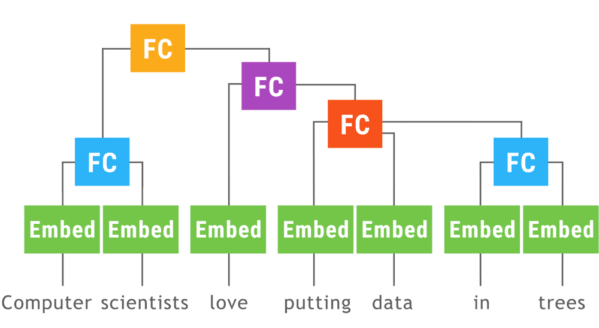

## 以静制动 Dynamic Batching
- **Authors**: [刘思聪](https://www.zhihu.com/people/Sicong_Liu/activities)
- **Link**: https://zhuanlan.zhihu.com/p/25216368
- **Tags**: `Optimization` 
- **Year**: 2017 

### Motivation
- 动态图：命令式编程(**Imperative**)，根据实时需求构建对应的计算图(**define-by-run**),灵活，方便调试
    - 在NLP等输入不定的情况下，动态图比较符合实际需求      
    - 但很多时候效率没有静态图好
- 静态图：符号式编程(**Symbolic**), 在计算流程完全定义好后才被执行，提前优化网络，尽可能全局最优  
  
### Solution
- Dynamic Batching

- 一个模型可以拆分为两种基本组件
  - **Tensor**(中间结果，像相同大小和材质的砖头)
  - **Operation**(中间结果, 计算子图)
- Dynamic Batching是一个贪婪（greedy）的算法，它接受一个**有向无环计算图**作为输入:
  - 给图中的每一个节点（操作）标注一个深度，没有任何依赖的节点标注为深度0，依赖的节点深度最大为d的节点的深度标注为d+1；
  - 在图中插入pass-through（直通）的操作，使得第d+1层只依赖于第d层；
  - 将**同一深度涉及相同操作的节点合并到一起，方便并行计算**；
  - 将同一深度的计算结果按Tensor类型（包括Tensor的形状和数值类型）有序拼接在一起；
  - 将输入原始计算图中的每条边标记上（深度，数据类型，序号），对应它们可以获取上一层计算结果的位置。

- 将串行变成并行   
- 类似与一个图片大小未知的输入，warmup之后，框架就会大致判断出他的内存消耗！！    