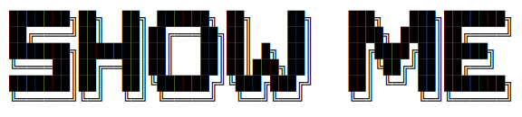

# Introduction
   
     

因为写博客太麻烦, 所以改用gitbook记录平时看的一些paper或是好的书. No Translation, Only Keypoint.   

### TODO
- 各个norm方式的整理   
- 各个优化方式的整理   
- 邓丹 MLY-zh-cn.pdf
- Pixor: Real-time 3d object detection from point clouds.

- pointnet思路的系列
  - Mining Point Cloud Local Structures by Kernel Correlation and Graph Pooling   

- STDN: Scale-Transferrable Object Detection   
- ECCV2018目标检测（object detection）算法总览    
- CVPR2018 目标检测算法总览(最新的目标检测论文)   

- face++组工作介绍
- 目标检测还有什么好做的？
- Scale-Aware Trident Networks for Object Detection

- 卡尔曼滤波、匈牙利匹配算法多目标追踪

- Class-Balanced Loss Based on Effective Number of Sample

-  RoarNet: A Robust 3D Object Detection based on RegiOn Approximation Refinement
-  [VoxelNet: End-to-End Learning for Point Cloud Based 3D Object Detection](https://arxiv.org/abs/1711.06396)
- [3d fully convolutional network for vehicle detection in point cloud](https://arxiv.org/abs/1611.08069)
- [Fusing Bird View LIDAR Point Cloud and Front View Camera Image for Deep Object Detection](https://arxiv.org/abs/1711.06703)
- [Fast and Furious: Real Time End-to-End 3D Detection, Tracking and Motion Forecasting with a Single Convolutional Net](http://openaccess.thecvf.com/content_cvpr_2018/papers/Luo_Fast_and_Furious_CVPR_2018_paper.pdf)
- [PIXOR: Real-time 3D Object Detection from Point Clouds](http://openaccess.thecvf.com/content_cvpr_2018/papers/Yang_PIXOR_Real-Time_3D_CVPR_2018_paper.pdf)

- [SPLATNet: Sparse Lattice Networks for Point Cloud Processing](http://vis-www.cs.umass.edu/splatnet/) 
- [PointNet](https://arxiv.org/pdf/1612.00593.pdf), [PintNet++](https://arxiv.org/pdf/1706.02413.pdf)
- [PointFusion: Deep Sensor Fusion for 3D Bounding Box Estimation](https://arxiv.org/abs/1711.10871)

- [Consistent Optimization for Single-Shot Object Detection](https://arxiv.org/pdf/1901.06563.pdf)   
- [MXNet Gluon 上实现跨卡同步 Batch Normalization](https://zh.mxnet.io/blog/syncbn)

- [Bottom-up Object Detection by Grouping Extreme and Center Points](https://arxiv.org/pdf/1901.08043.pdf)
- [Improved Selective Refinement Network for Face Detection](https://arxiv.org/pdf/1901.06651.pdf)

- [SECOND-V1.5](https://github.com/traveller59/second.pytorch)

学习C++的时候，学这个    
- [Dijkstra最短距离算法]()

NAdam了解一下   
